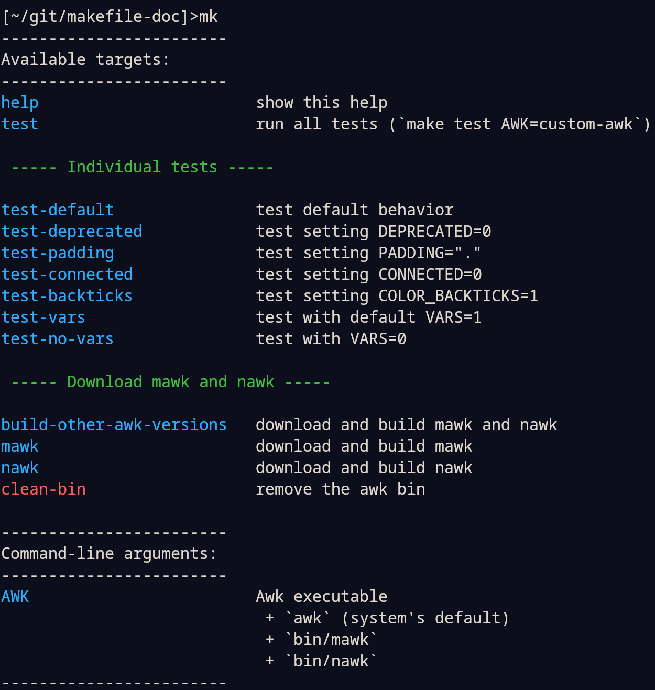

# Awk script for Makefile docs

The `makefile-doc.awk` script is a POSIX-compliant extension of a simple `awk` one-liner
I have been using for years (it was based on [this
gist](https://gist.github.com/prwhite/8168133)). I simply needed a bit more
functionality and this turned out to be a nice small project with Awk.

## How to use

### Make available on the fly

Define the first target of your `Makefile` (or if it is not the first target, set
`.DEFAULT_GOAL := help`) as:

``` make
help: DIR := $(HOME)/.local/share/makefile-doc
help: URL := github.com/drdv/makefile-doc/releases/latest/download/makefile-doc.awk
help: ## show this help
	@test -f $(DIR)/makefile-doc.awk || wget -q -P $(DIR) $(URL)
	@awk -f $(DIR)/makefile-doc.awk $(MAKEFILE_LIST)
```

This will download the awk script on the fly (if it doesn't exist in
`~/.local/share/makefile-doc`). As an alternative of `wget` you could use `curl`:

```
curl -sLO --create-dirs --output-dir $(DIR) $(URL)
```

### Manual installation

Define the first target of your `Makefile` as:

``` make
help: ## show help
	@awk -f makefile-doc.awk $(MAKEFILE_LIST)
```

Manually download and place the `makefile-doc.awk` script on your `AWKPATH`.

## Docs syntax

``` make
## doc of a CLA variable the user might want to know about
MY_VARIABLE = 42

## top doc line 1
## line 2
target1:

target2: ## inline doc (ignored if there are top docs as well)
```

I refer to targets / variables as anchors (for docs/sections).

+ Docs of anchors start with tokens `##` or `##!` or `##%` (they can be both above an
  anchor or inline).

+ To emphasize anchors that are "special" in some way, start their docs with `##!` (this
  changes their color).

+ To indicate that an anchor is deprecated, start its docs with `##%` (this changes its
  color and allows to filter it out, see the `DEPRECATED` flag below).

+ Multi-line docs can be added above an anchor, inline docs are ignored when top docs
  are present. Only the first line in a multi-line doc need to include a token with an
  emphasis (i.e., `##!` or `##%`).

+ Sections can be defined using `##@`. All lines in a multi-line section should start
  with `##@` (empty lines are ignored). There should be at least one anchor (possibly a
  hidden deprecated one) after a section for it to be displayed.

* [Double-colon](https://www.gnu.org/software/make/manual/html_node/Double_002dColon.html)
  targets are displayed using the format `target-name:target-index` and for each index
  there can be a dedicated documentation.

* [Grouped](https://www.gnu.org/software/make/manual/html_node/Multiple-Targets.html)
  targets are displayed with a `&` at the end, e.g., `t1 t2 t3&`. Double-colon grouped
  targets are handled as well.

+ See `test/Makefile*` for examples.

**Note**: in general, using inline comments with variables is not a good idea because
["trailing space characters are not stripped from variable
value"](https://www.gnu.org/software/make/manual/html_node/Simple-Assignment.html).

## Options

The following options can be passed to `awk` using `-v option=value` (possible values
are given in `{...}`, `(.)` shows the default)

* `VARS`: `{0, (1)}` 1 show documented variables; 0 don't show
* `PADDING`: `{(" "), ".", ...}` a single padding character between anchors and docs
* `DEPRECATED`: `{0, (1)}` 1 show deprecated anchors; 0 don't show
* `OFFSET`: `{0, 1, (2), ...}` number of spaces to offset docs from anchors
* `CONNECTED`: `{0, (1)}` 1 ignore docs followed by an empty line; 0 join them
+ Colors:
  + `COLOR_DEFAULT`: (`34`: blue) for anchors whose docs start with `##`
  + `COLOR_ATTENTION`: (`31`: red) for anchors whose docs start with `##!`
  + `COLOR_DEPRECATED`: (`33`: yellow) for anchors whose docs start with `##%`
  + `COLOR_WARNING`: (`35`: magenta) for warnings
  + `COLOR_SECTION`: (`32`: green) for sections
  + `COLOR_BACKTICKS`: (`0`, disabled) used for text in backticks in docs

  Colors are specified using the parameter in ANSI escape codes, e.g., the parameter for
  blue is the 34 in `\033[34m`.

Running `awk -f makefile-doc.awk` outputs help with values of options.

Cloning this repository (at tag `v0.1`) and running `make` outputs:


## Dependencies

+ `awk`, tested with (on fedora, ubuntu, macos):
  + [gawk](https://www.gnu.org/software/gawk) `5.2.2`, `5.1.0` (with `--posix` flag)
  + [nawk](https://github.com/onetrueawk/awk) tag `20240728`
  + [mawk](https://invisible-island.net/mawk) `1.3.4 20240905` (with  `-W posix` flag)
  + [busybox awk](https://www.busybox.net/) `1.35.0`
  + [wak](https://github.com/raygard/wak) `v24.10`
+ `GNU Make`

## Running the tests

Execute `make test` (this uses the system's default `awk`). To test with a custom
`awk`, use (you need a standard build environment):

+ `make test AWK=mawk`
+ `make test AWK=nawk`
+ `make test AWK=bawk` (binaries not available for macos)
+ `make test AWK=wak`

Note that the makefiles in `./test` are not meant to be used manually, they are part of
the tests.
